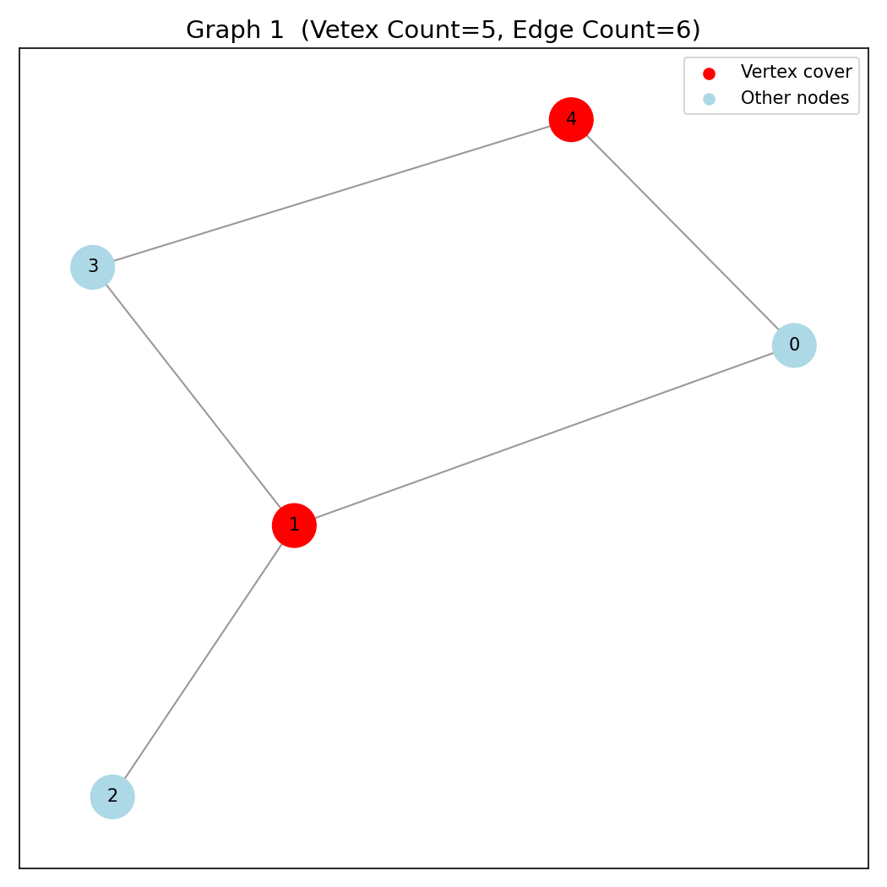
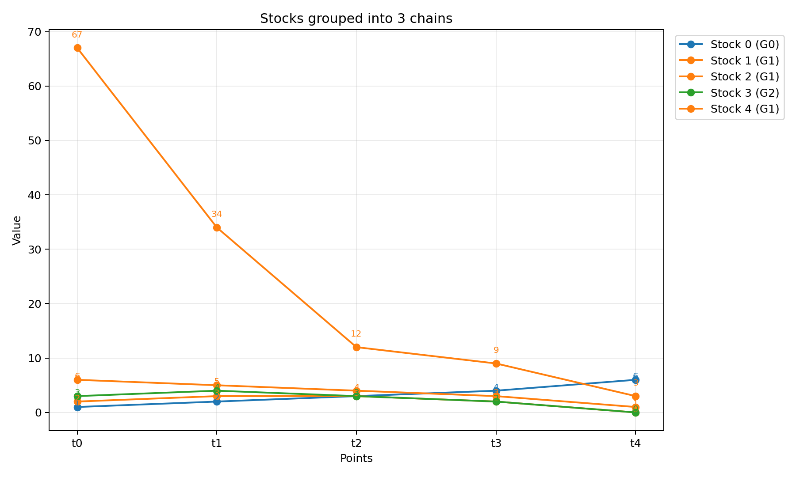

# Vertex Cover Problem On Bipartite Graphs
In this project, we study the NP-hard **Vertex Cover** problem, focusing on a special and tractable class of graphs: **bipartite graphs**. We implement the fundamental algorithms designed specifically for this case and build a framework that can be applied to real-world scenarios; most notably, computing the vertex cover of a bipartite graph and solving a practical application: determining the **minimum number of charts** required to display the price movements of multiple stocks.

This report is organized as follows: we first present the theoretical background, then discuss the key theorems and algorithms, and finally develop and apply the code to these real-world problems. Click the link below for GitHub repo.

<p align="left">
  <a href="https://github.com/VikasMaurya07/vertex_cover_on_bipartite.git">
    
  </a>
</p>

---

## 🎯 Vertex Cover Problem
Given a graph $ G = (V, E) $;
A **vertex cover** is a set of vertices $C \subseteq V $ such that **every edge** in $ E $ has at least one endpoint in $ C $. Formally:

$$\forall (u, v) \in E,\quad u \in C \text{ or } v \in C$$

> A vertex cover “touches” every edge; no edge is left completely uncovered.

The **Vertex Cover Problem** asks to find a vertex cover of **minimum possible size**. Mathematically:
$$ \text{Minimize } |C| \text{ such that } C \text{ is a vertex cover of } G $$

### Example:
Consider this simple graph:

```
   A --- B --- C
```

Possible vertex covers:

  * $ C = [B] $  (covers both edges)
  * $ C = [A,C] $  (also covers both edges)
  * $ C = [A,B,C] $  (but not minimal)

So, **minimum vertex cover size = 1** i.e, $[B]$.

### Complexity:
* For **general graphs** (not necessarily bipartite),
  the Vertex Cover Problem is **NP-hard**; we don’t know any polynomial-time algorithm to find the minimum one.

* For **bipartite graphs**, however, König’s theorem + polynomial matching algorithms (like Kuhn's Matching) give a **polynomial-time solution**.

### Connection to Independent Set:
*Complementary view:*
An **independent set** is a set of vertices with **no edges** between them. If $I$ is an independent set, then $V \setminus I$ is a vertex cover. So:

$$\text{Max Independent Set} + \text{Min Vertex Cover} = |V|$$

Since maximum independent set is also NP-hard, so is minimum vertex cover.

---

## 🎯 **What is a Matching?**

Given a graph $G = (V, E)$ a **matching** $M \subseteq E$ is a set of edges such that **no two edges share a common vertex**. Formally:
$$
\forall (u_1,v_1),(u_2,v_2)\in M,\quad {u_1,v_1}\cap{u_2,v_2} = \emptyset
$$
> So each vertex is incident to **at most one edge** of the matching.

### Maximum Matching Problem:

The **maximum matching problem** asks to find a matching $M$ of **maximum cardinality** (i.e., with the largest number of edges). That is:
$$
\text{Maximize } |M|\quad\text{subject to } M \text{ is a matching in } G
$$

### Example:
```
A --- B --- C --- D
```
Possible matchings:

* $ M_1 = [AB]$ 
* $ M_2 = [BC]$ 
* $ M_3 = [CD]$ 
* $ M_4 = [AB, CD]$ 

Maximum matching size = **2** i.e, $[AB,CD]$.

### Complexity:

**For bipartite graphs:**

* The problem can be solved in **polynomial time**.
* **Hopcroft–Karp algorithm** → $ O(E\sqrt{V}) $, **Kuhn's algorithm** → $ O(EV) $
* Can also be reduced to a **maximum flow** problem.

**For general (non-bipartite)** graphs:

* Solved using **Edmonds’ Blossom algorithm** (polynomial time but more complex $ O(EV^2) $ ).

### Connection to Vertex Cover (König’s Theorem):

There’s a deep duality between **vertex cover** and **matching**. In **bipartite graphs**, these two have the *same* optimal value; that’s **König’s theorem**:

$$
\boxed{\text{Maximum Matching Size} = \text{Minimum Vertex Cover Size}}
$$

### Example Combining Both:

Let’s take the bipartite graph:

```
X1 --- Y1
 |      |
 |      |
X2 --- Y2
```

* Maximum Matching: size = 2; $[X1Y1, X2,Y2]$
* Minimum Vertex Cover: size = 2; $[X1, Y2]$

---

## 🎯 König’s theorem
In any finite bipartite graph $G=(X\cup Y, E)$ the size of a maximum matching equals the size of a minimum vertex cover:
$$\tau(G)=\nu(G) $$
Where $\tau(G)$ is the maximum number of pairwise disjoint edges (maximum matching size) and $\nu(G)$ is the minimum number of vertices meeting every edge (minimum vertex cover size). We prove $\tau(G)\le\nu(G)$ and then show $\nu(G)\le\tau(G)$ by constructing a vertex cover of size equal to a maximum matching.

### Easy direction:
Every edge in a matching must be covered by distinct vertices of any vertex cover (no two matched edges share an endpoint in a matching). Thus a vertex cover must contain at least one endpoint from each matched edge; so the cover size is at least the matching size. Hence 
$$\tau(G)\le\nu(G)$$

### Constructing a cover of size $\tau(G)$:
Let $M$ be a maximum matching in the bipartite graph $G=(X\cup Y,E)$. We will build a vertex cover $C$ with $|C|=|M|$, proving $\nu(G)\le|M|=\tau(G)$.

#### Build the alternating-reachability set:

* Call a vertex **free** if it is *not* incident to any edge of $M$.
* Consider the directed exploration that starts from all free vertices in $X$ and follows **alternating paths**:
  * From a vertex in $X$ follow edges **not** in $M$ to $Y$.
  * From a vertex in $Y$ follow edges **in** $M$ to $X$.
* Let $Z$ be the set of vertices reachable from free vertices of $X$ by such alternating paths. Partition $Z$ as $Z_X=Z\cap X$ and $Z_Y=Z\cap Y$.

> Intuition: $Z$ is exactly the set of vertices reachable by alternating paths starting at unmatched left-side vertices.

#### Define the candidate cover:
$
C = (X\setminus Z_X)\ \cup\ (Z_Y).
$
> In words: take all vertices of $X$ that were **not** reached, together with all vertices of $Y$ that **were** reached.
We will show; $C$ is a vertex cover and $|C|=|M|$.

#### $C$ is a vertex cover:

Take any edge $e=uv$ with $u\in X$, $v\in Y$. We show $u\in C$ or $v\in C$.

* If $u\in Z_X$ then by the definition of $Z$ every edge $u w$ not in $M$ that is outgoing from $u$ to $Y$ leads to a reachable $w\in Z_Y$. In particular, if $uv\in E$ and $uv\notin M$, then $v\in Z_Y\subseteq C$.
* If $uv\in M$, and $u\in Z_X$, then the matched edge from $u$ goes to some $v$; but our alternating reachability rules ensure that when a vertex in $X$ is reachable, the matched edge $if any$ goes to the corresponding $Y$ vertex only if that $Y$ vertex is also reachable; so again $v\in Z_Y\subseteq C$.
* If $u\notin Z_X$, then $u\in X\setminus Z_X\subseteq C$.

Thus every edge has at least one endpoint in $C$. So $C$ is a vertex cover.

>*A compact way to see this: if an edge has its $X$-endpoint reachable then its $Y$-endpoint is reachable too (by alternating-step rules) and so in $C$; otherwise the $X$-endpoint itself is in $C$.*

#### Proving $|C|=|M|$:

We count how many vertices of $C$ come from $X$ and from $Y$.

**Claim A.** Every vertex of $Z_Y$ is matched (incident to an $M$-edge).
Proof: If $y\in Z_Y$ is reachable by an alternating path, the path alternates and the last step to $y$ came along a non-matching edge from some $x\in Z_X$; but by the alternating rules from $y$ we follow the matching-edge (if any) to continue. If $y$ were unmatched, the alternating path from a free $x$ to $y$ would be an augmenting path (starts and ends at free vertices and alternates), contradicting maximality of $M$. So all vertices in $Z_Y$ are matched.

**Claim B.** Every vertex of $X\setminus Z_X$ is matched.
Proof: If $x\in X\setminus Z_X$ were unmatched $free$, then it would have been in the starting set of the exploration and thus in $Z_X$. So it must be matched.

Thus every vertex in $C=(X\setminus Z_X)\cup Z_Y$ is matched by $M$. Moreover, each matched edge of $M$ has exactly one endpoint in $C$:

* If an edge $xy\in M$ has $x\in X\setminus Z_X$, then $x\in C$ while $y\notin Z_Y$ (otherwise $x$ would be reachable via that matched edge), so $y\notin C$.
* If $x\in Z_X$, then matching forces $y\in Z_Y$; then $y\in C$ while $x\notin C$.

> Therefore the matched edges give a bijection between elements of $M$ and vertices of $C$: each matched edge contributes exactly one vertex to $C$, and every vertex of $C$ is matched and corresponds to a distinct matched edge. So $|C|=|M|$.

---
## 🎯 Implementation of Bipartite Vertex Cover Problem
**Directory:** ```bip_vertex_cover```
**Problem Statement:** To find the **Veterx Cover** of an input Bipartite Graph, and to visualise the results using a python script.
#### Implementation Workflow:

* The C++ driver program ```main.cpp``` reads multiple test cases from ```tests.txt```.
* Bipartite Vertex Cover Framework (`utils.hpp`):
  * Verifies if a graph is bipartite using 2-Coloring algorihm and outputs the Left and Right subgraphs
  * Uses Kuhn's Algorithm to find the maximum matching in the given bipartite gtaph
  * Uses Konig's Theorem to find the **Vertex Cover** from the given matching.
  * Outputs the Vertex Cover to the `main` file.
* The outputs from the `main` are passed on to the `visualise.py` as directive for plotting graphs and representing the vertex cover.
* `run_all.sh` is a bash script to automate the process of creating graph plots.

#### Kuhn’s Algorithm:
Kuhn’s algorithm is a **DFS-based augmenting path algorithm** for maximum bipartite matching.
1. For each left vertex $u$, try to find an augmenting path using DFS.
2. If an unmatched right vertex is found, or we can re-route an existing match, we match $u$.
3. Each DFS either:
   * increases the matching size by 1, or
   * returns false.
> Worst case: **O(V × E)**

#### Minimum Vertex Cover Using König’s Theorem:
Given a maximum matching $M$, the minimum vertex cover in bipartite graphs is computed by:
1. Mark all **unmatched left vertices**.
2. Run DFS/BFS alternating between:
   * **non-matching edges (L → R)**
   * **matching edges (R → L)**
3. Let:
   * `visL` = visited left vertices
   * `visR` = visited right vertices
4. The minimum vertex cover is:
```
(Left \ visL)  ∪  (Right ∩ visR)
```
> **Total Complexity:** 
  Building adjacency: **O(E)**
  DFS alternation: **O(V + E)**
  Total: **O(V × E)** (due to matching step dominating)

#### Python Visualization Workflow:
A Python script reads the C++ output:
* Draws the original graph using NetworkX
* Colors:
  * **Vertex cover nodes** in green
  * Others in blue
  * Improper edges in dashed red (if user-specified L/R fails)
* Saves images into `visuals/case_i.png`

Run as:
```bash
python3 visualize.py < output_for_python.txt
```

#### Input Format (`tests.txt`):
Each test case:

```
num_vertices num_edges
u v
u v
...
```

Example:

```
4 4
0 1
1 2
2 3
3 0
```

Output: 


#### Running Everything:

We provide a script `run_all.sh`, to run everything at once. Run with:

```bash
./run_all.sh
```
---

## 🎯 Chart Minimisation Problem
**Directory:** ```chart_minimisation```
**Problem Statement:** Given the price history of $ n $ stocks over $ k $ time points, we want to visualize these stocks using the **minimum number of charts**, where:
  * Each chart may display **multiple stocks**, and
  * A stock $A$ can be placed together with another stock *$B*$ on the same chart *only if* stock $A$ is strictly lower than stock $B$ at **every time point**.
Formally, for two stocks represented as vectors:
  $$
  A = (A_1, A_2, \dots, A_k), \quad
  B = (B_1, B_2, \dots, B_k)
  $$
Stock $ A $ can appear on the same chart as stock $ B $ if:
$$
A_i < B_i \quad \text{for all } i = 1, 2, \dots, k
$$
This defines a **partial order** among the stocks.

It is a direct instance of a very important and widely applicable combinatorial problem:
> **Minimum Path Cover in a DAG** ↔ **Maximum Matching in a Bipartite Graph**
**Minimum Path Cover:** Smallest possible number of paths needed to cover all vertices without breaking the direction constraints.

This problem can be extended to a range of real world problems such as;
* Task Scheduling with Precedence Constraints
* Exam or Class Timetabling
* Layering and Ranking in Graph Drawing
* Comparative Genomics / DNA Sequence Evolution

#### Graph-Theoretic Reformulation:
1. Create a directed edge $ A \to B $ if stock $ A $ is strictly lower than stock $ B $ at all time points.
2. Convert this DAG into a bipartite graph by duplicating nodes into Left and Right partitions.
3. Find the **maximum bipartite matching**, which corresponds to the maximum number of stock pairs that can be placed consecutively on a single chart.
4. Using **Dilworth’s theorem / minimum path cover in DAGs**, the **minimum number of charts required** is:
$$
\text{Minimum Charts} = n - \text{size of maximum matching}
$$

#### Dilworth's Theorem:
Dilworth’s Theorem is a fundamental result in order theory that connects two important concepts in a **partially ordered set (poset)**: 
* **Chains** → sequences where every pair of elements is comparable
* **Antichains** → sets where no two elements are comparable
> In any poset, the minimum number of chains required to cover all elements equals the size of the largest antichain. In simpler terms: If many elements cannot be compared with each other (a large antichain exists), we need at least that many chains to cover the set.

In the Chart Minimisation problem:
  * Each stock is an element in a poset (defined by dominance of prices).
  * Each chart corresponds to a **chain** of comparable stocks.
  * The minimum number of charts equals the size of the largest antichain.

Using bipartite matching, we compute this via the equivalent formulation:
$$
\text{Minimum Path Cover} = n - \text{Maximum Matching}
$$

#### Implementation Workflow:

* The C++ driver program ```main.cpp``` reads multiple test cases from ```tests.txt```.
* The stock data is passed to the `MinCharts` functions, which creates the required Bipartite Graph of stock data.
* The `find_matching` function of `utils.hpp` outputs the maximum matching of the bipartite graph, using Kuhn's algo.
* This matching is then passed to the `build_chain` function of `utils_chart.hpp` which outputs the chart groupings for all the stocks.
* The outputs from the `main` are passed on to the `visualise.py` as directive for plotting the data. Here we plot all the stocks on one cchart and show which stock belongs to which chart number using colors.
* `run_all.sh` is a bash script to automate the process of creating graph plots.

#### Algorithm for finding Chart Groupings:
Once the maximum bipartite matching has been computed (where each stock appears once on the left and once on the right), we convert the matching into **actual chart groups**. Each group corresponds to one **directed chain** of stocks that can be plotted together on the same chart. The algorithm consists of three main steps:

**1. Build Successor and Predecessor Maps:**
From the matching result:
* If left-stock $ u $ is matched to right-stock $ v $, we create a **successor** link $ u \rightarrow v $
* At the same time, we mark $ u $ as the **predecessor** of $ v $.

This produces two arrays:
* `succ[u] = v` → the next stock in the chain
* `pred[v] = u` → the previous stock in the chain
All unmatched stocks simply have `succ = -1` and `pred = -1`. These links represent how stocks can be arranged sequentially in a valid chart.

**2. Identify Chain Starts and Build Chains**
A chain must start at a stock with **no predecessor**. For every such stock:
* Start walking forward using `succ`
* Collect all stocks along the path
* Stop when no further successor exists or when a repeated node would introduce a cycle

Each walk yields **one complete chart group**. This constructs all “maximal” chains corresponding to maximum matching.

> **Total Complexity:** 
  Building adjacency: **O(E)**
  Max Matching: **O(V × E)**
  Chart grouping: **O(V + E)**
  Total: **O(V × E)** (due to matching step dominating)

#### Python Visualization Workflow:
A Python script reads the C++ output:
* Draws the charts using MatplotLib
* Colors the same for all the stocks belonging to the same chart
* Saves images into `visuals/graph_i.png`

Run as:
```bash
python3 visualize.py < output_for_python.txt
```
#### Input Format (`tests.txt`):
Each test case:

```
num_stocks num_points
p1 p2 ... pn
p1 p2 ... pn
...
```

Example:

```
5 5
1 2 3 4 6
2 3 4 6 7
6 5 4 3 1
3 4 5 2 3
67 34 12 9 0
```
Output:


#### Running Everything:

We provide a script `run_all.sh`, to run everything at once. Run with:

```bash
./run_all.sh
```
---

## 📚 References

* **Kuhn’s Algorithm: Maximum Bipartite Matching**
  [https://cp-algorithms.com/graph/kuhn_maximum_bipartite_matching.html](https://cp-algorithms.com/graph/kuhn_maximum_bipartite_matching.html)

* **Vertex Cover (Graph Theory)**
  [https://en.wikipedia.org/wiki/Vertex_cover](https://en.wikipedia.org/wiki/Vertex_cover)

* **Dilworth’s Theorem (Posets & Chain Decomposition)**
  [https://www.geeksforgeeks.org/dsa/dilworths-theorem/](https://www.geeksforgeeks.org/dsa/dilworths-theorem/)

* **Kőnig’s Theorem: Vertex Cover = Maximum Matching (Bipartite)**
  [https://en.wikipedia.org/wiki/K%C5%91nig%27s_theorem_(graph_theory)](https://en.wikipedia.org/wiki/K%C5%91nig%27s_theorem_%28graph_theory%29)


